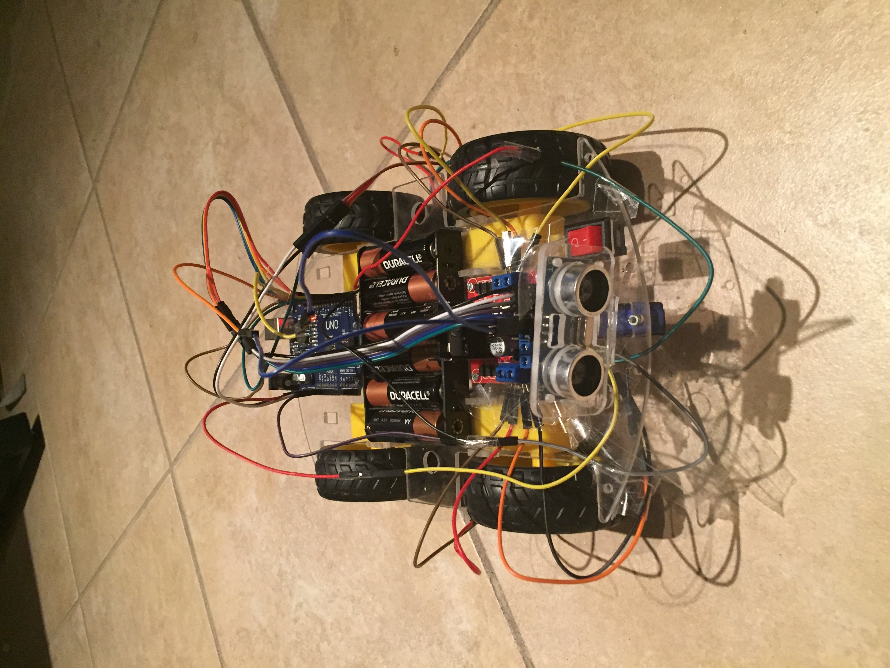
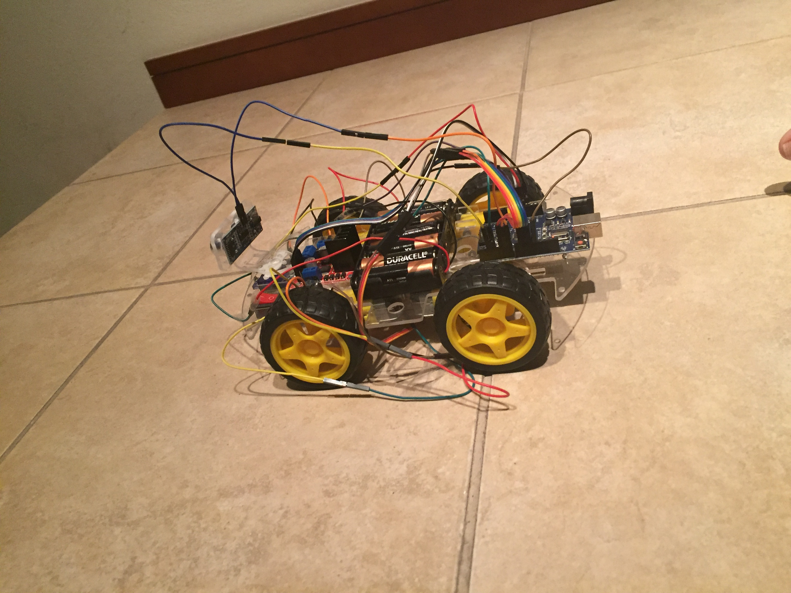
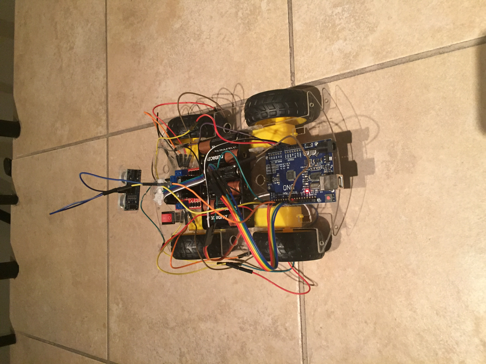

# Arduino_Robot

**Version 1.0.0**

A robot will find a way to get out of a maze using an ultrasonic sensor and various motors. 

Serial communication between Python and Arduino will be established in order to use Arduino as a data adquisition program and Python as a computation program.

## Contributors 

- Mateo Caso <https://github.com/CasoMateo>
- Eduardo L. Santos <https://github.com/EduardoSantos7> 

## Components 

- Arduino Uno. 
- Driver L298N. 
- 6 AA Bateries. 
- A set of jumpers. 
- 4 DC Motors. 
- Servomotor.
- Ultrasonic Sensor. 

## Demo Code 

If distance_obs < min_distance:
  move_forward()
Else: 
  Serial.write(distance_sides().encode()) 
  if Serial.read() == left: 
     move_left() 
  else: 
     move_right() 
 
## Installation Details 

Arduino, itself, and its drivers were installed through <https://www.arduino.cc/en/software>.

Serial needs to be installed through Python with the use of the **_PiP_** command. 
If the file is not found, creating a virtual environment will be necessary..

## Robot and Results 

